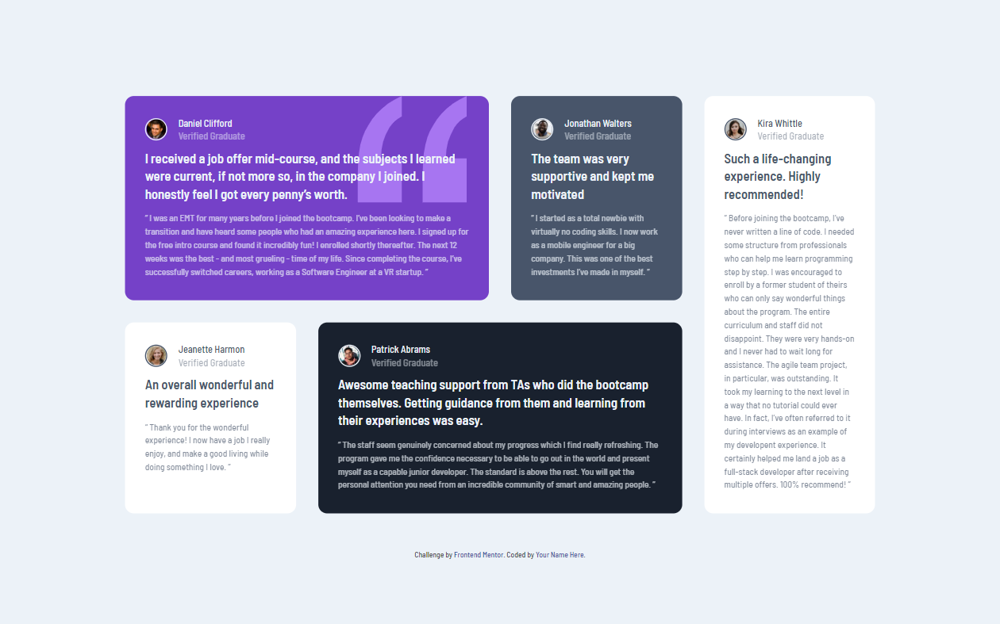

# Frontend Mentor - Testimonials grid section solution

This is a solution to the [Testimonials grid section challenge on Frontend Mentor](https://www.frontendmentor.io/challenges/testimonials-grid-section-Nnw6J7Un7). Frontend Mentor challenges help you improve your coding skills by building realistic projects. 

## Table of contents

- [Overview](#overview)
  - [The challenge](#the-challenge)
  - [Screenshot](#screenshot)
  - [Links](#links)
- [My process](#my-process)
  - [Built with](#built-with)
  - [What I learned](#what-i-learned)
  - [Continued development](#continued-development)
  - [Useful resources](#useful-resources)
- [Author](#author)
- [Acknowledgments](#acknowledgments)

**Note: Delete this note and update the table of contents based on what sections you keep.**

## Overview

### The challenge

Users should be able to:

- View the optimal layout for the site depending on their device's screen size

### Screenshot

## Desktop design: 

## Mobile design:

### Links

- Solution URL On [GitHub repository](https://github.com/DavidUpegui/FEM---Testimonial_Grid_Section---HTML-CSS)
- Live Site URL [Here](https://davidupegui.github.io/FEM---Testimonial_Grid_Section---HTML-CSS/)

## My process

### Built with

- Semantic HTML5 markup
- CSS custom properties
- CSS Grid
- Mobile-first workflow
- Reset.css file

### What I learned

I learned to apply Grid to projects.

### Continued development

Grid is a powerfull tool, I need to explore it more

## Author

- GitHub - [@DavidUpegui](https://github.com/DavidUpegui)
- Frontend Mentor - [@DavidUpegui](https://www.frontendmentor.io/profile/DavidUpegui)

